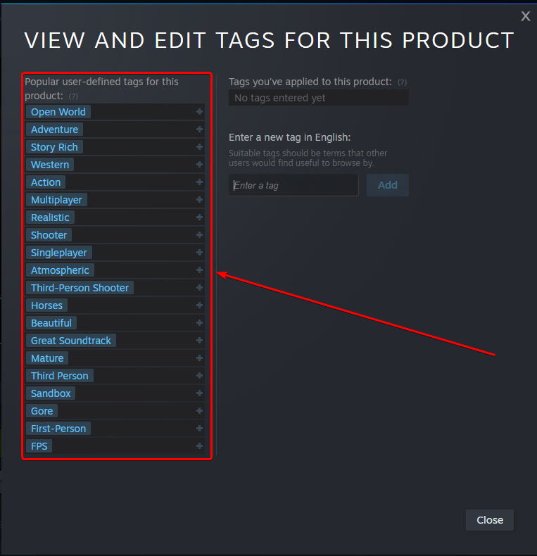

# **Worth it or Not?**

This is my very first large scale project where I developed an desktop windows application from start to finish coding both the backend, information storage, retrieval, & processing, and frontend. This application was made so that it can help people who, like me, prefer to play games that they are able to get their money's worth from. Why should I spend somewhere in the neighborhood of $60-70 on a game + potential DLCs or season passes, when it will only be a mere 10 hours of gameplay with no replayability.

As of the current moment the application is fully functional and finished. I am in the process of turning all the necessary code into .exe files, but their are still a few features/quality of life things that I would like to the app, and I still need to figure out how to turn it into a .exe without it using a gigabyte of space, because pyinstaller thinks it needs all 300 something packages I have installed to package for this one application.

---

## **Installation Guide:**

Fair warning, the application itself has been tested. It works, with no glitches (at least as far as I know) and as intended. Yet I am running a windows machine. This has not been tested over different operating systems, different versions of python, different hardware, etc. If you are familiar with computers and working with them, then fell free to modify it as you see fits. However the following should be every piece of software you need to be able run my code.

1. Install Python 3.9.7
2. Make sure Python is added to the list of your environment variables (if you're on windows)
3. Using  `pip install libraryName==X`, install the following libraries:
   - numpy version 1.21.2
   - scikit-learn version 1.0.2
   - howlongtobeatpy version 0.1.22
4. Run main.py to start the application

---
## **FAQs:**

> What is the cache file for? Is it safe to delete?

The cache file is used to remember a game's genre based on the game ID, that way when you want to add it to your list of played games, or you want to "re-predict" that game, you don't have to re-insert the genres for it. Yes, the file is safe to delete.

> What do these prediction names mean? Which one should I trust?

Going down the list, the names mean the following:
- SVM ([Support Vector Machine](https://en.wikipedia.org/wiki/Support-vector_machine)): This is actually an SVR or Support Vector Regression, what it does is just try to minimize some measure of metric for Loss over the entire data.
- SGD ([Stochastic Gradient Descent](https://en.wikipedia.org/wiki/Stochastic_gradient_descent)): Very much similar to SVM, except this is a linear function and the loss is optimized via SGD.
- DNN_RELU ([Dense Neural Network, Rectified Linear Unit](https://en.wikipedia.org/wiki/Artificial_neural_network)): Unlike the two previous ones, Neural Networks are far more complex models that are able to draw better boundaries than the previous two. Uses the ReLU activation function.
- DNN_IDN ([Dense Neural Network, Identity](https://en.wikipedia.org/wiki/Artificial_neural_network)): Same as the previous model, except it uses an identity activation function.
- SVD ([Singular Value Decomposition](https://en.wikipedia.org/wiki/Singular_value_decomposition)): Using a Matrix factorization, this algorithm uses low rank approximation to make numerical estimates.

As for which one to use, then it depends on the game, and the data that you have added. If you play a lot of shooters, and the algorithm is trying to predict a shooter, then all 5 of the algorithms should give very reasonable estimates, with the two Neural Networks possibly being a bit too generous. If you query a game that has many genres which you have not yet played before, then the two Neural Networks and the SVM are ones that can tend to have quite a lot of error. For example, it has been observed that the Neural Network using the identity as an activation function can go negative. As for the SVM, while it has very bad loss (way to evaluate numerical error) on the training set, it still performs reasonably well on any instance that is queried that has sufficent data.

> What genres do I pick from steam to add to a game?

If you go on the steam page of a game, and look under publisher/developer, there should be a few tags there. Click on the `+` to pull up an even bigger menu such as the one shown in the image below, and from my observations, there tends to be ~20 of them per game.

